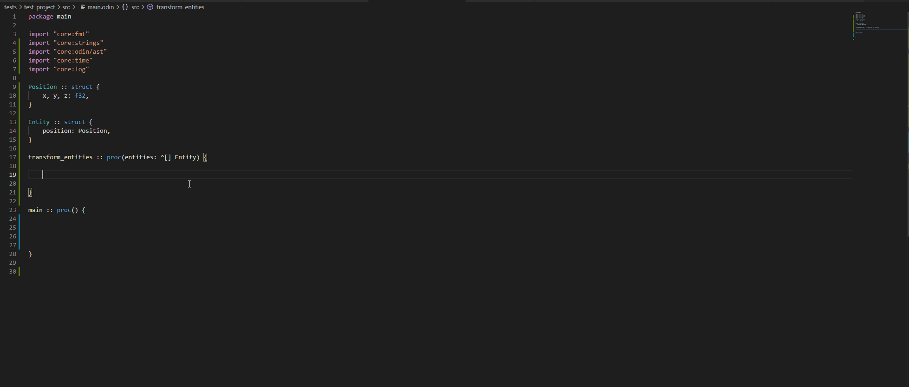

# ols
Language server for Odin. This project is still in early development.



## Table Of Contents
- [Installation](#installation)
  - [Configuration](#Configuration)
- [Features](#features)
- [Clients](#clients)
  - [Vs Code](#vs-code)
  - [Sublime](#sublime)
  - [Vim](#vim)
- [Missing features](#missing-features)

## Installation

 ```
 cd ols
 ./build.bat
 ```

### Configuration

All configurations is contained in one json file that must be named ```ols.json``` in your main workspace.

In order for the language server to index your files, the ols.json must contain all the collections in your project.

Example of ols.json:

```
{
  "collections": [{ "name": "core", "path": "c:/path/to/Odin/core" },
                  { "name": "shared", "path": "c:/path/to/MyProject/src" }],
  "thread_pool_count": 4,
  "enable_semantic_tokens": false,
  "enable_document_symbols": true,
  "enable_hover": true
}

```

## Features
  Support Language server features:
  - Completion
  - Go to definition
  - Semantic tokens(really unstable and unfinished)
  - Document symbols
  - Signature help
  - Hover

## Clients

### VS Code
Install the extension https://github.com/DanielGavin/ols-vscode
### Sublime
Install the package https://github.com/sublimelsp/LSP

Configuration of the LSP:
```
{
	"clients":
	{
		"odin":
		{
			"command":
			[
				"C:/path/to/ols"
			],
			"enabled": true,
			"languageId": "odin",
			"scopes":
			[
				"source.odin"
			],
			"syntaxes":
			[
				"Packages/Odin/Odin.sublime-syntax"
			]
		}
	},
	"only_show_lsp_completions": true,
}

```

### Vim
Install [Coc](https://github.com/neoclide/coc.nvim).

Configuration of the LSP:
```
{
  "languageserver": {
    "odin": {
      "command": "ols",
      "filetypes": ["odin"],
      "rootPatterns": ["ols.json"],
      "trace.server": "verbose"
    }
  }
}
```

## Missing-features
  Background indexer to complement the static indexer.
